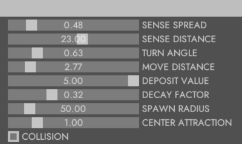

# Physarum

Inspired by [Sage](https://www.sagejenson.com/physarum) (based on [this paper](http://eprints.uwe.ac.uk/15260/1/artl.2010.16.2.pdf)).

### Cool gifs 3D

### Cool gifs 2D
Slime-mold-ish behavior

Something different, and cooler

