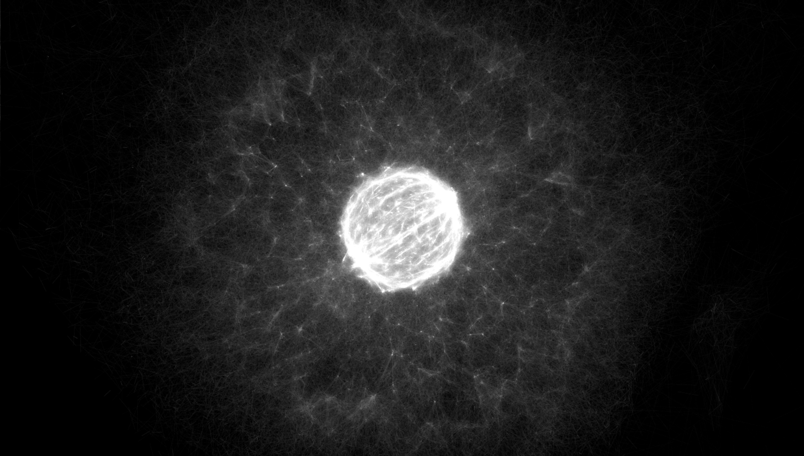
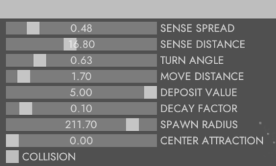
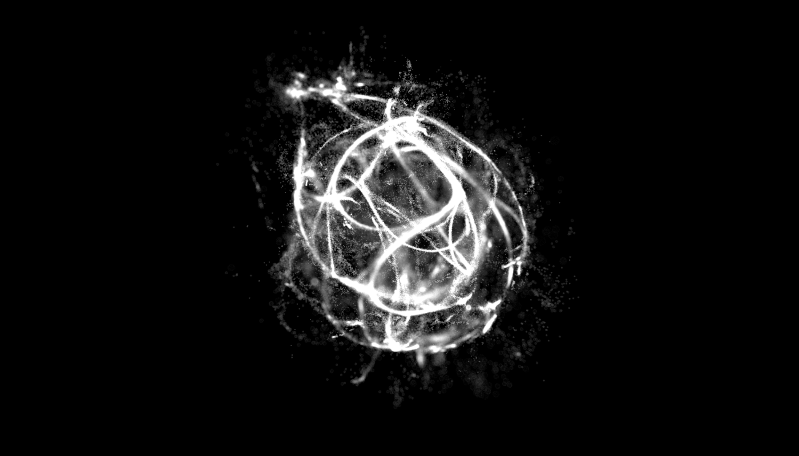
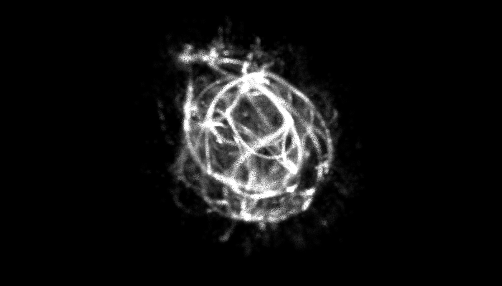
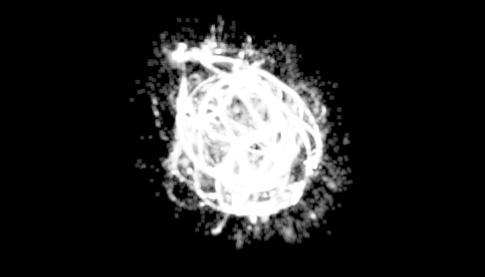
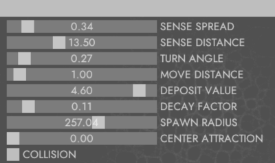
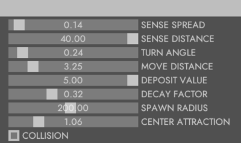

# Physarum

Inspired by [Sage](https://www.sagejenson.com/physarum) (based on [this paper](http://eprints.uwe.ac.uk/15260/1/artl.2010.16.2.pdf)).

## Cool gifs 3D

## Some videos exploring parameter space (links to higher quality videos below)

[video1](https://twitter.com/i/status/1117963204791951362)
[video2](https://twitter.com/i/status/1117981241947516928)
[video3](https://twitter.com/i/status/1117981391986159616)
[video4](https://twitter.com/i/status/1117994756389216256)
[video5](https://twitter.com/i/status/1117994952804278273)

## [DoF Rendering](https://inconvergent.net/2019/depth-of-field/)

### DoF rendering of particle pairs

### DoF rendering of particles

### DoF rendering of trail map

### Vanilla rendering of trail map

## Cool gifs 2D
Slime-mold-ish behavior

Something different, and cooler

# Build Instructions

**Requirements:**
* Visual Studio (preferably 2019 or 2017)
  
**Steps**
1. Clone [Builder repo](https://github.com/janivanecky/builder)
2. Make sure that path in `build.bat` inside Builder repo points to existing `vcvarsall.bat` (depends on your VS installation version)
3. Run `build.bat`
4. Optionally run `setup.bat` to setup PATH - you'll be able to run builder just by using `build` command
5. Clone [cpplib repo](https://github.com/janivanecky/cpplib)
6. Clone this repo
7. Run `build run physarum.build` - if you didn't setup PATH in step 4, you'll have to use `YOUR_BUILDER_REPO_PATH/bin/build.exe` instead

If there are any problems you encounter while building the project, let me know.